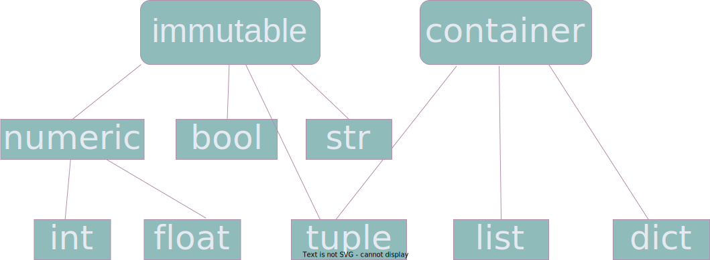

+++
title = "資料型別"
date = "2022-04-08T23:49:29-03:00"
author = ""
authorTwitter = "" #do not include @
cover = ""
tags = ["code", "python"]
keywords = []
description = ""
showFullContent = false
readingTime = false
hideComments = false
+++

# 資料型別

# 前置動作

首先，我們要打開教學用的工具，python repl。我們要在命令行輸入`python` （在macos和linux是python3），如果沒有報錯，那這樣我們可以輸入`1 + 1`，如果他顯示`2`，就代表我們成功了！

```
Python 3.9.0 (v3.9.0:9cf6752276, Oct  5 2020, 11:29:23) 
[Clang 6.0 (clang-600.0.57)] on darwin
Type "help", "copyright", "credits" or "license" for more information.
>>> 1 + 1
2
```

類似這樣，首先讓我們的命令行維持這樣，接下來我來講解一下python的一些基礎型別。我將會為每種型別都弄一個分類，但不會到太詳細。

# 整理分類

## basic

basic，中文為基礎型別，在python基礎型別為：`int`，`float`，`bool`，`str`，`tuple`，`list`和`dict`。在每個語言都不一樣，語言本身提供的最簡單的型別都會被稱為基礎型別。

## immutable

immutable，中文為不可變型別，在創建後無法再改變。

## container

container，中文為容量類型別，不常見分類，可以用來存儲多個數值。

## numeric

numeric，中文為數字類型別，可以進行數學計算，比較。

# int

`int`，全名為integer，中文為整數，屬於不可變，數字類型別，字面上的意思。可以進行 加 減 乘 除。

## 加

```
>>> 1 + 1
2
```

## 減

```
>>> 1 - 1
0
```

## 乘

```
>>> 10 * 2
20
```

## 除

```
>>> 10 / 2
5
```

# float

`float`，非簡寫，中文譯為浮點數，屬於不可變，數字類型別，代表的是有小數點的數值。例如`3.141549` ，跟`int`一樣可以進行加減乘除

# str

`str`，string的簡寫，中文譯為字串，屬於不可變型別，也就是一串字符，代表文字的資料結構。如果你要弄一個內容為`python` 的字串，你要

```
>>> "python"
'python'
```

## 加在一起

```
>>> "Hello" + " World"
'Hello World'
```

Q：欸？奇怪，為什麼顯示的字串跟我們寫得不太一樣？

A：這是因為，字串有兩種寫法，如果你要按照顯示出來的寫，也是完全沒問題的！

```
>>> 'python'
'python'
```

# bool

`bool`，全名為boolean，中文譯為布林值，屬於不可變型別。這個型別不像別的型別一樣，組合千千萬萬，像是int可以`-9223372036854775806`到`9223372036854775807`都算為int，但是bool只有`False`和`True` ，也就是`否`和`是` ，一般用於呈現是和否的東西，像是燈有沒有開，有沒有成年，已婚，等等。

```
>>> False
False
```

```
>>> True
True
```

## 生成布林值

會得到一個布林值

```
>>> 1 > 2
False
>>> 2 > 1
True
```

也可以查看是否一樣

```
>>> 1 == 1
True
>>> 0 == 1
False
```

不只適用於`int`，所有基礎型別都可以

```
>>> "Hello" == "Hello"
True
```

# tuple

`tuple`，非簡寫，中文譯為元組，屬於不可變，容量型別。可以把一群資料整合在一起，並且之後可以用循序位置來獲得資料，比喻說。。。

```
>>> ("first", "second")
("first", "second")
```

這是一個很普通的`tuple`，裡面裝著一些資料。

```
>>> ("first", "second")[0]
'first'
```

要取得第一個資料，就用`0`，以此類推，第二個就是`1`

# list

`list`，非簡寫，中文為列表，屬於可變型別，容量型別，跟`tuple`很相似，但不完全一樣，之後會完整的講述他們的區別。

```
>>> ["first", "second"]
['first', 'second']
```

```
>>> ["first", "second"][0]
'first'
```

唯一的差異是不可變性，之後會解釋，這個會牽涉到記憶體。

# dict

`dict`, 全名dictionary，中文為字典，屬於容量型別。可以靠一開始或者之後新增的數值來取得數值。

```
>>> {"English": "英文"}
{'English': '英文'}
>>> {"English": "英文"}["English"]
'英文'
```

可以看到我們用的是`str`作為**鑰匙**的，但其實我們可以用任何一種型別的東西，像是`int`，`float`, `str`，`bool`，`tuple`，但必須要是**不可變型別**或**可哈希型別**。所有的**不可變型別**都是**可哈希型別**，但所有的**可哈希型別**不都是**不可變型別**。

# 型別分類



這個是我弄得概念圖，可以隨意在別的地方使用，不過要提及作者是誰。

# 作者的廢話

- 順便一提所有不算為**不可變型別**的型別，都算為**可變型別**
- 概念圖是使用draw.io畫的

> 作者：蘋果
>
